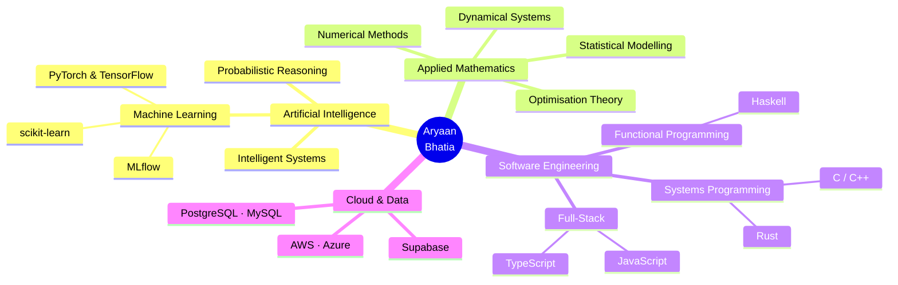

<!-- Advanced Futuristic Header -->
<div align="center">


<h1>
  
</h1>

<table align="center">
<tr>
<td align="center" width="220">

</td>
<td align="center" width="220">

</td>
<td align="center" width="220">

</td>
</tr>
</table>


</div>

---

## 🎯 MISSION CONTROL

<table align="center">
<tr>
<td width="50%" valign="top">

### 📡 CURRENT STATUS
```yaml
background:  Actuarial Studies AI @ UNSW (B.Sc.)
Job:  Mathematician @ Aristocrat
currently:   Masters in Applied Mathematics
major:       Applied Mathematics
focus:       ML · Systems · Software Engineering
mission:     Bridge deep theory with real-world code
status:      [█████████████░░░░░] Growing every day...
```

</td>
<td width="50%" valign="top">

### 💫 QUICK PROFILE
```javascript
const aryaan = {
  degrees: ["Actuarial @ UNSW", "AI @ UNSW", "Masters Applied Math"],
  stack:   ["Python", "Rust", "C++", "TypeScript"],
  loves:   ["Optimisation", "ML Pipelines", "Systems"],
  goal:    "Find every application of AI that exists",
  belief:  "Deep theory → better software"
};
```

</td>
</tr>
</table>

---

## 🛸 TECHNOLOGY MATRIX

<div align="center">

### ⚙️ CORE LANGUAGES

<table>
<tr>
<td align="center" width="130">

<br><strong>Python</strong>
<br><sub>Advanced</sub>
</td>
<td align="center" width="130">

<br><strong>Rust</strong>
<br><sub>Proficient</sub>
</td>
<td align="center" width="130">

<br><strong>C / C++</strong>
<br><sub>Advanced</sub>
</td>
<td align="center" width="130">

<br><strong>TypeScript</strong>
<br><sub>Proficient</sub>
</td>
<td align="center" width="130">

<br><strong>Haskell</strong>
<br><sub>Proficient</sub>
</td>
</tr>
</table>

### 🔧 FULL ARSENAL

         

      

        

</div>

---

## 📊 PERFORMANCE ANALYTICS

<div align="center">


</div>

<div align="center">

</div>

---

## 🎮 KNOWLEDGE GRAPH

<div align="center">



</div>

---

## 💡 RESEARCH & BUILD LOG

<div align="center">

```diff
+ Studying:   Advanced optimisation and numerical analysis (Masters)
+ Applying:   AI techniques across finance, science, and engineering domains
+ Building:   Tools that turn mathematical models into usable software
! Exploring:  Where ML theory meets production-grade systems
- Refining:   Systems-level thinking through C++, Rust, and low-level design
```

</div>

---

## 📡 TRANSMISSION LOG

<div align="center">

```python
class Developer:
    def __init__(self):
        self.name        = "Aryaan Bhatia"
        self.degrees     = ["B.Sc. Artificial Intelligence @ UNSW",
                            "Masters in Applied Mathematics (in progress)"]
        self.languages   = ["Python", "Rust", "C++", "Haskell", "TypeScript", "R"]
        self.philosophy  = "Understand the maths. Then write the code."

    def mission(self):
        print("Find every application of AI that exists.")
        print("Build software grounded in real mathematical understanding.")
        print("Keep growing. Every single day.")

me = Developer()
me.mission()
```

</div>

---

<div align="center">

### ⚡ *"Mathematics is the language of the universe. Code is how you make it speak."* ⚡

### ✍️ Random Dev Quote


[](https://visitcount.itsvg.in)

<sub>💻 Built on theory. Grounded in code. Always learning. ✦ Last Updated: 2026</sub>

</div>

<!-- Proudly created with GPRM ( https://gprm.itsvg.in ) -->
